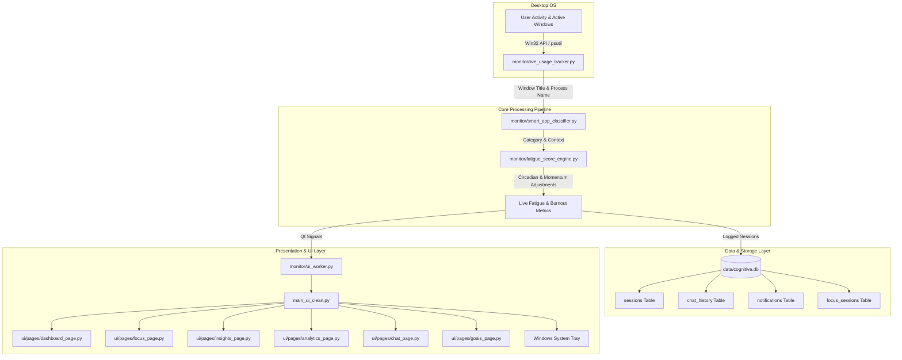

# Cognitive AI — Product Manual & Architecture Guide

Cognitive AI is an on-device, privacy-preserving desktop wellbeing and productivity operating system designed for Windows. It monitors digital work patterns, estimates cognitive load and fatigue in real time, and helps prevent burnout through smart breaks and structured focus intervals.

---

## 1. Product Capabilities & Modules

| Module | Feature | Function |
|---|---|---|
| **📊 Dashboard** | Real-Time Digital Operating View | Live focus score, active window & app context, burnout risk gauge, today's deep work accumulation, distraction counter, 5-day active streak, and contextual AI recommendations. |
| **🧠 Insights** | Automated Behavioral Analytics | Analyzes context switching rhythms, detects peak stamina windows, maps midday circadian dips, and computes application-level flow state correlations. |
| **🎯 Focus Mode** | Deep Work Sprint Engine | Pomodoro (25m), Deep Work (50m), Flow (90m), and micro-break presets (5m, 15m) with progress tracks, topbar sync, audible completion alerts, and session history logging. |
| **📈 Analytics** | Quantitative Workload Telemetry | Multi-day workload trends, category mix distributions, top application leaderboards, and hourly density metrics backed by SQLite. |
| **🤖 AI Coach** | Local Context-Aware Companion | Conversational agent integrated with local context, SQLite chat history persistence, and offline diagnostic fallback protocols for daily summaries and fatigue remediation. |
| **🏆 Goals & Streaks** | Habit Formation & Milestones | Real-time tracking against customizable targets (deep work target, distraction caps, daily screen time budgets) and milestone achievement unlocks. |
| **🔔 Notifications** | Activity & Health Log | Feed of context switch notifications, fatigue alerts, and completed sprint records with priority badges and history management. |
| **⚙️ Settings** | Privacy & Local OS Integration | Granular local-first privacy toggles, Windows auto-start registry integration, dark/light theme switching, and data backup/export tools. |

---

## 2. Technical Architecture & Data Flow



---

## 3. SQLite Database Schema (`data/cognitive.db`)

1. **`sessions`**: Tracks continuous application foreground usage.
   - `id`: INTEGER PRIMARY KEY AUTOINCREMENT
   - `app_name`: TEXT (e.g. `Code.exe`, `chrome.exe`)
   - `window_title`: TEXT (active document or page title)
   - `category`: TEXT (`Development`, `Browsing`, `Entertainment`, `Communication`, etc.)
   - `duration_sec`: INTEGER (active duration)
   - `fatigue_score`: REAL (0.0 to 100.0)
   - `burnout_score`: REAL (0.0 to 1.0)
   - `timestamp`: DATETIME DEFAULT CURRENT_TIMESTAMP

2. **`focus_sessions`**: Tracks deliberate focus sprint completions.
   - `id`: INTEGER PRIMARY KEY AUTOINCREMENT
   - `duration_sec`: INTEGER (completed duration)
   - `status`: TEXT (`completed`, `paused`)
   - `timestamp`: DATETIME DEFAULT CURRENT_TIMESTAMP

3. **`chat_history`**: Persistent turn-by-turn AI coaching conversations.
   - `id`: INTEGER PRIMARY KEY AUTOINCREMENT
   - `user_msg`: TEXT
   - `ai_msg`: TEXT
   - `timestamp`: DATETIME DEFAULT CURRENT_TIMESTAMP

4. **`notifications`**: Auditable event log of warnings, achievements, and nudges.
   - `id`: INTEGER PRIMARY KEY AUTOINCREMENT
   - `priority`: TEXT (`Info`, `Alert`, `Focus`, `Streak`)
   - `message`: TEXT
   - `timestamp`: DATETIME DEFAULT CURRENT_TIMESTAMP

---

## 4. Running the Application

### Development Mode:
```bash
python main_ui_clean.py
```

### Building the Standalone Windows Executable (`CognitiveAI.exe`):
To package the app into a self-contained desktop release without requiring Python installed:
```bash
python package_app.py
```
Or double-click:
```bash
build.bat
```
The compiled product will be generated in `dist/CognitiveAI/` ready for distribution.

---

## 5. Security & Privacy Assurance
- **100% Local-First Architecture**: Application telemetry, window titles, and focus states never leave the device.
- **Single-Instance Enforcement**: Utilizes system-level shared memory to guarantee only one lightweight tracking instance is active.
- **Clean Background Minimization**: Minimizes silently to the Windows System Tray with double-click restore and full quit management.
