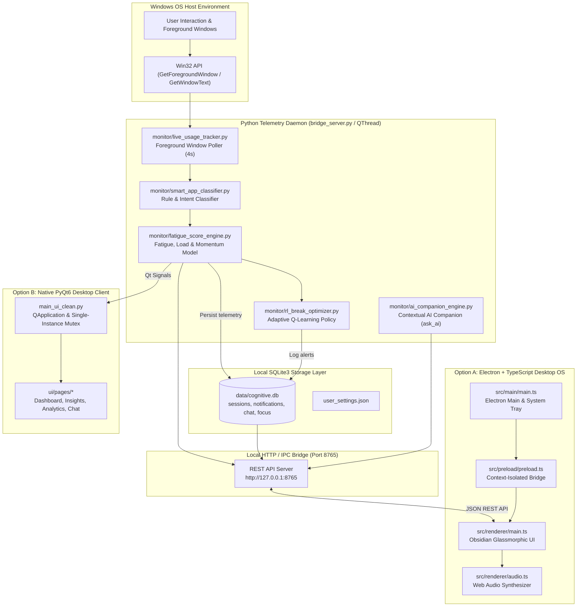

# Cognitive AI — Cognitive Fatigue & Wellbeing OS

<div align="center">

[](#)
[](#)
[](#)
[](#)
[](#)
[](#)

<p align="center">
  <strong>An autonomous, privacy-preserving desktop operating system that continuously monitors digital workload patterns, models mental fatigue in real time using bio-mathematical algorithms, and prevents cognitive burnout through adaptive micro-breaks, binaural soundscapes, and structured focus flow states.</strong>
</p>

</div>

---

## 📌 Table of Contents

- [1. Executive Summary](#1-executive-summary)
- [2. The Problem: Attention Residue & Silent Exhaustion](#2-the-problem-attention-residue--silent-exhaustion)
- [3. Architectural Pillars](#3-architectural-pillars)
- [4. Complete System Architecture & Data Flow](#4-complete-system-architecture--data-flow)
- [5. Dual UI Presentation Surfaces](#5-dual-ui-presentation-surfaces)
  - [5.1. Premier Electron + TypeScript Glassmorphic OS](#51-premier-electron--typescript-glassmorphic-os)
  - [5.2. Native PyQt6 Desktop Client](#52-native-pyqt6-desktop-client)
- [6. Core Feature Breakdown](#6-core-feature-breakdown)
  - [6.1. Executive Cognitive Dashboard](#61-executive-cognitive-dashboard)
  - [6.2. Focus Sprint Engine & Particle Confetti](#62-focus-sprint-engine--particle-confetti)
  - [6.3. Ambient Web Audio Synthesizer (Binaural & Noise)](#63-ambient-web-audio-synthesizer-binaural--noise)
  - [6.4. Guided 4-7-8 Mindful Breathing Modal](#64-guided-4-7-8-mindful-breathing-modal)
  - [6.5. Global Command Palette (Ctrl+K)](#65-global-command-palette-ctrlk)
  - [6.6. AI Behavioral Insights & Circadian Telemetry](#66-ai-behavioral-insights--circadian-telemetry)
  - [6.7. Deep Analytics & Standalone Executive HTML Reports](#67-deep-analytics--standalone-executive-html-reports)
  - [6.8. Context-Aware AI Cognitive Coach](#68-context-aware-ai-cognitive-coach)
  - [6.9. Habit Streaks, Milestones & Gamification](#69-habit-streaks-milestones--gamification)
  - [6.10. Cognitive Audit Log & Event Notifications](#610-cognitive-audit-log--event-notifications)
  - [6.11. System Settings & Custom Calibration](#611-system-settings--custom-calibration)
- [7. Mathematical & Algorithmic Formulation](#7-mathematical--algorithmic-formulation)
  - [7.1. Dynamic Cognitive Fatigue Accumulation](#71-dynamic-cognitive-fatigue-accumulation)
  - [7.2. Attention Residue & Context-Switch Penalty](#72-attention-residue--context-switch-penalty)
  - [7.3. Circadian Rhythm Modulation Curve](#73-circadian-rhythm-modulation-curve)
  - [7.4. Focus Stamina Normalization Formula](#74-focus-stamina-normalization-formula)
  - [7.5. Reinforcement Learning Micro-Break Policy (Q-Learning)](#75-reinforcement-learning-micro-break-policy-q-learning)
- [8. Bridge Telemetry REST API Specification](#8-bridge-telemetry-rest-api-specification)
- [9. Local Database Schema (`data/cognitive.db`)](#9-local-database-schema-datacognitivedb)
- [10. Repository Directory Structure](#10-repository-directory-structure)
- [11. Quick Start & Execution Guide](#11-quick-start--execution-guide)
  - [11.1. Prerequisites](#111-prerequisites)
  - [11.2. One-Command Master Launchers](#112-one-command-master-launchers)
  - [11.3. Developer Hot-Reloading Mode](#113-developer-hot-reloading-mode)
- [12. Standalone Windows Packaging (PyInstaller `.exe`)](#12-standalone-windows-packaging-pyinstaller-exe)
- [13. Troubleshooting & FAQ](#13-troubleshooting--faq)
- [14. Privacy & Data Sovereignty Governance](#14-privacy--data-sovereignty-governance)

---

## 1. Executive Summary

**Cognitive AI** is an enterprise-grade desktop productivity operating system designed to shield knowledge workers, developers, and researchers from chronic cognitive fatigue and attention fragmentation. 

Operating passively with sub-1% CPU overhead on Windows 10 and 11, Cognitive AI tracks foreground window transitions, categorizes tasks in real time, and models mental fatigue dynamics via biological cognitive load equations.

Cognitive AI provides two complete frontend implementations sharing a unified backend engine:
1. **Modern Electron + TypeScript Glassmorphic UI:** Built with Vite, TypeScript 5.7, Web Audio API oscillators, canvas particle confetti, frameless custom window controls, and an Obsidian Dark design system.
2. **Native PyQt6 Desktop UI:** Built with hardware-accelerated Qt widgets, Windows System Tray integration, and single-instance Windows mutex memory locks.

---

## 2. The Problem: Attention Residue & Silent Exhaustion

Digital professionals face unprecedented cognitive fragmentation:
- **Attention Residue:** Switching frequently between an IDE, documentation, communication channels (Slack/Teams), and social feeds leaves neural residue that degrades working memory.
- **Unreliable Subjective Fatigue Awareness:** Humans are biologically poor at diagnosing early fatigue; by the time cognitive exhaustion is consciously felt, error rates increase by up to 300%.
- **Rigid Timer Inefficiency:** Traditional static timers (e.g. rigid Pomodoro) interrupt deep creative flow states unnecessarily or fail to demand recovery breaks during high cognitive intensity.

Cognitive AI resolves this by actively measuring digital friction and intervening adaptively when neural strain surpasses safe thresholds.

---

## 3. Architectural Pillars

- **🛡️ 100% On-Device Privacy (Zero Telemetry Leakage):** Keystrokes, clipboard content, and screen pixels are never captured or transmitted. All data stays local in `data/cognitive.db`.
- **⚡ Non-Blocking Telemetry Daemon:** Windows GUI event polling and state modeling run in an independent daemon thread / subprocess, guaranteeing the UI remains responsive at 60 FPS.
- **🎧 Real-Time In-App Sound Synthesis:** Employs the Web Audio API to procedurally generate 14Hz Alpha binaural beats, brown noise, and rain ambience on the fly without relying on external media assets.
- **🪟 Commercial Frameless Obsidian Window Controls:** Sleek dragging zones (`-webkit-app-region: drag`), integrated titlebar search, and custom Obsidian-styled minimize, maximize, and close-to-tray controls.
- **🔄 Intelligent Multi-Runtime Launcher:** A master orchestrator (`run.py`, `run_app.bat`, `run_app.ps1`) automatically connects the background engine with the appropriate desktop UI and handles clean shutdown.

---

## 4. Complete System Architecture & Data Flow



---

## 5. Dual UI Presentation Surfaces

### 5.1. Premier Electron + TypeScript Glassmorphic OS
The flagship frontend presents an Obsidian Dark aesthetic (`#07090E`) with translucent cards, glowing interactive borders, and smooth micro-animations:
- **Framework:** Electron 33 + Vite + TypeScript 5.7.
- **Audio Engine:** Pure Web Audio API synthesis generating binaural beats, brown noise, and rain ambience.
- **Window Management:** Frameless custom window frame with custom minimize, maximize, and close-to-tray controls.
- **Particle Dynamics:** Canvas-based confetti explosions celebrating completed focus sprints.

### 5.2. Native PyQt6 Desktop Client
A lightweight, zero-Node alternative built with native Python bindings:
- **Framework:** PyQt6 Modern Dark.
- **Lifecycle:** System tray minimization, Windows taskbar grouping (`AppUserModelID`), and `QSharedMemory` single-instance lock.
- **Sound System:** Native Windows audio synthesis via `winsound` waveform buffer generators.

---

## 6. Core Feature Breakdown

### 6.1. Executive Cognitive Dashboard
- **Dynamic Circular Stamina Ring:** Animated SVG circular gauge representing current cognitive stamina (0–100%), smoothly transitioning between Emerald (`#10B981`), Amber (`#F59E0B`), and Coral (`#F43F5E`).
- **Burnout Probability Meter:** Algorithmic calculation of accumulated neurological fatigue.
- **Deep Work Quota Tracker:** Shows productive hours logged today versus user-defined daily targets.
- **Context Switching Rate:** Visual indicator highlighting working memory disruption risks.
- **Active Task Stream:** Live display of the foreground process, title, and classified cognitive category.

### 6.2. Focus Sprint Engine & Particle Confetti
- **Flexible Sprint Durations:** Quick-select modes for 25m Pomodoro, 50m Deep Work, 90m Flow State, and 5m Micro Breaks.
- **Acoustic Cue Chimes:** Harmonic frequencies chime on session commencement, pause, and completion.
- **Celebration Confetti:** Multi-colored canvas confetti blast triggers upon completing a sprint.
- **Automatic Logging:** Saves completed sessions directly to `data/cognitive.db`.

### 6.3. Ambient Web Audio Synthesizer (Binaural & Noise)
Integrated directly into the Electron client with zero external audio assets:
1. **14Hz Alpha Binaural Drone:** Dual-oscillator stereo detuning (196Hz left / 210Hz right) targeting parietal brainwave entrainment for relaxed alertness.
2. **Deep Brown Noise:** Algorithmic Brownian motion buffer with 450Hz low-pass filtration for acoustic friction dampening.
3. **Gentle Rain Ambience:** Filtered pink-white noise matrix with low-frequency droplet resonance.

### 6.4. Guided 4-7-8 Mindful Breathing Modal
A clinical autonomic nervous system reset routine:
- **4s Inhale:** Visual circle expands with smooth scaling and soft teal illumination.
- **7s Hold:** Visual circle holds high tension with an iris glow.
- **8s Exhale:** Circle contracts to resting state, resetting sympathetic nervous arousal.
- Automatically logs restorative breaks to the audit database upon completion.

### 6.5. Global Command Palette (`Ctrl+K`)
Keyboard-driven launcher accessible across any screen:
- Jump to Dashboard, Focus Sprints, Insights, Analytics, AI Coach, Streaks, or Settings.
- Quick actions: Toggle Focus Shield, Take a 4-7-8 Mindful Break, Generate Executive Report, and Clear Audit Logs.

### 6.6. AI Behavioral Insights & Circadian Telemetry
- **Context Switching Velocity:** Calculates average minutes before switching tasks and flags high-residue patterns.
- **Peak Stamina Window:** Identifies the precise hour of the day when focus stamina reaches its maximum.
- **Circadian Energy Tracking:** Pinpoints postprandial fatigue dips and recommends task reallocation.

### 6.7. Deep Analytics & Standalone Executive HTML Reports
- **Multi-Day Trends:** Toggle between 1-Day, 7-Day, and 30-Day performance windows.
- **Daily Focus Bar Chart:** Interactive visual representation of productive screen time.
- **Category Breakdown:** Percentage distribution across Development, Writing, Reading, Communication, and Distraction.
- **Top Apps Leaderboard:** Application-specific time allocation and individual focus ratings.
- **Standalone Executive HTML Report:** One-click export that generates a comprehensive executive summary (`data/reports/CognitiveAI_Report_*.html`) and opens it in your default browser.

### 6.8. Context-Aware AI Cognitive Coach
- Built-in interactive chat connected to `ask_ai` in `monitor/ai_companion_engine.py`.
- Evaluates recent telemetry, fatigue score, and distraction counts to provide actionable advice.
- Quick prompt chips for instant fatigue reset strategies, schedule recommendations, and mental routines.

### 6.9. Habit Streaks, Milestones & Gamification
- Tracks consecutive active deep work days.
- **Achievement Badges:**
  - 🥉 *Pioneer Spark* — 1-Day Active Streak (Unlocked)
  - 🥈 *Deep Worker* — 7-Day Active Streak
  - 🥇 *Focus Monk* — 30-Day Active Streak
  - 💎 *Zenith Titan* — 5+ Hours of Daily Deep Work

### 6.10. Cognitive Audit Log & Event Notifications
- Chronological event stream tracking system alerts, fatigue thresholds, sprint completions, and breaks.
- Categorized by severity (Alert, Focus, Break, Info) with a one-click history purge.

### 6.11. System Settings & Custom Calibration
- Custom focus hour goals, distraction limits, and total screen time thresholds.
- Sound effect toggles and automated system startup configurations.

---

## 7. Mathematical & Algorithmic Formulation

### 7.1. Dynamic Cognitive Fatigue Accumulation

Cognitive fatigue evolves at each tracking epoch $\Delta t$ based on task intensity and duration momentum:

$$\Delta F = \alpha_{\text{cat}} \cdot \left(\frac{\Delta t}{60}\right) \cdot M$$

Where:
- $\alpha_{\text{cat}}$ represents the cognitive load coefficient by application category:
  - **Development / Coding:** $\alpha = 1.25$
  - **Writing / Documentation:** $\alpha = 1.10$
  - **Productive Reading / Research:** $\alpha = 0.95$
  - **Communication / Email:** $\alpha = 1.15$
  - **Social Media / Distraction:** $\alpha = 1.40$ (High attention fragmentation)
  - **Rest / Break:** $\alpha = -1.80$ (Active fatigue recovery)
- $M$ is the momentum multiplier reflecting unbroken screen duration:

$$M = 1.0 + \gamma \cdot \left(\frac{t_{\text{unbroken}}}{3600}\right), \quad \gamma = 0.35$$

### 7.2. Attention Residue & Context-Switch Penalty

Switching focus between disparate applications introduces an executive function tax:

$$F_{t} = F_{t-1} + \Delta F + P_{\text{switch}}$$

$$P_{\text{switch}} = 
\begin{cases} 
1.20 & \text{if switching from Deep Work to Distraction} \\ 
0.60 & \text{if switching between distinct productive applications} \\ 
0.00 & \text{if remaining within the same task category}
\end{cases}$$

### 7.3. Circadian Rhythm Modulation Curve

Fatigue susceptibility varies based on biological circadian rhythms throughout the 24-hour cycle:

$$C(h) = 1.0 + 0.25 \cdot \cos\left(\frac{2\pi (h - 14)}{24}\right) + 0.15 \cdot \cos\left(\frac{2\pi (h - 3)}{12}\right)$$

Where $h \in [0, 23]$ is the local hour of the day. This models:
- Morning peak alertness ($09:00 - 11:30$)
- Postprandial afternoon dip ($14:00 - 15:30$)
- Late-night depletion curve ($22:00 - 04:00$)

### 7.4. Focus Stamina Normalization Formula

To provide an intuitive metric for users, the continuous fatigue score $F \in [0, \infty)$ is mapped to an inverse **Focus Stamina Index** $S \in [0, 100]$:

$$S = \max\left(0, \min\left(100, \text{round}(100 - F \times 1.25)\right)\right)$$

- **Optimal Peak:** $S \ge 75$ (Emerald)
- **Moderate Strain:** $45 \le S < 75$ (Amber)
- **Depleted / Break Recommended:** $S < 45$ (Coral)

### 7.5. Reinforcement Learning Micro-Break Policy (Q-Learning)

Micro-break timing is optimized using tabular Q-learning:

$$Q(s, a) \leftarrow Q(s, a) + \alpha \left[ R + \beta \max_{a'} Q(s', a') - Q(s, a) \right]$$

- **State Space ($s$):** Discretized tuple of $(\text{Fatigue Bucket}, \text{Continuous Work Time}, \text{Context Switch Count})$.
- **Action Space ($a$):** $\{\text{Continue}, \text{Micro Break (3m)}, \text{Mindful 4-7-8 Break (5m)}, \text{Full Break (15m)}\}$.
- **Reward Function ($R$):** Positive for maintained stamina and sprint completions; penalized for user-dismissed prompts or fatigue spikes.

---

## 8. Bridge Telemetry REST API Specification

The local bridge server runs on `http://127.0.0.1:8765`:

| Method | Endpoint | Description | Payload Example |
| :--- | :--- | :--- | :--- |
| `GET` | `/api/status` | Returns live fatigue, focus score, burnout, active app, streak, and goals | None |
| `POST` | `/api/focus/toggle` | Toggles Focus Shield mode on or off | None |
| `POST` | `/api/focus/log` | Logs a completed focus session sprint to database | `{"duration_sec": 1500}` |
| `POST` | `/api/break/complete` | Logs a restorative 4-7-8 mindful breathing break | None |
| `GET` | `/api/insights` | Computes 7-day algorithmic cognitive insights | None |
| `GET` | `/api/analytics` | Returns category distribution, top apps, and daily trends | `?days=7` |
| `POST` | `/api/report/generate` | Generates a standalone executive HTML report | None |
| `GET` | `/api/chat/history` | Retrieves recent AI coach conversation history | None |
| `POST` | `/api/chat` | Queries AI companion engine with session context | `{"prompt": "How is my energy?"}` |
| `GET` | `/api/notifications` | Returns logged audit events and alerts | None |
| `POST` | `/api/notifications/clear` | Clears all audit logs from database | None |
| `GET` | `/api/settings` | Returns user preferences and goals | None |
| `POST` | `/api/settings` | Updates and persists user preferences | `{"goal_focus_hours": 6}` |

---

## 9. Local Database Schema (`data/cognitive.db`)

All data is stored locally in SQLite with WAL (Write-Ahead Logging) enabled:

```sql
-- 1. Continuous telemetry sessions
CREATE TABLE IF NOT EXISTS sessions (
    id INTEGER PRIMARY KEY AUTOINCREMENT,
    app_name TEXT NOT NULL,
    window_title TEXT,
    category TEXT NOT NULL,
    duration_sec INTEGER NOT NULL,
    fatigue_score REAL NOT NULL,
    timestamp DATETIME DEFAULT CURRENT_TIMESTAMP
);

-- 2. Audit logs & alerts
CREATE TABLE IF NOT EXISTS notifications (
    id INTEGER PRIMARY KEY AUTOINCREMENT,
    type TEXT NOT NULL,
    message TEXT NOT NULL,
    timestamp DATETIME DEFAULT CURRENT_TIMESTAMP
);

-- 3. AI Coach conversation records
CREATE TABLE IF NOT EXISTS chat_history (
    id INTEGER PRIMARY KEY AUTOINCREMENT,
    user_prompt TEXT NOT NULL,
    ai_response TEXT NOT NULL,
    timestamp DATETIME DEFAULT CURRENT_TIMESTAMP
);

-- 4. Completed focus sprints
CREATE TABLE IF NOT EXISTS focus_sessions (
    id INTEGER PRIMARY KEY AUTOINCREMENT,
    duration_sec INTEGER NOT NULL,
    status TEXT NOT NULL,
    timestamp DATETIME DEFAULT CURRENT_TIMESTAMP
);

-- 5. User preferences & target thresholds
CREATE TABLE IF NOT EXISTS user_settings (
    key TEXT PRIMARY KEY,
    value TEXT NOT NULL
);
```

---

## 10. Repository Directory Structure

```text
cognitive_fatigue_ai_clean/
├── analytics/
│   └── report_generator.py         # Standalone executive HTML report generator
├── bridge_server.py                # Zero-dependency local REST API bridge (Port 8765)
├── build.bat                       # Standalone Windows compilation script
├── electron-app/                   # Premier Electron + TypeScript Glassmorphic OS
│   ├── index.html                  # Obsidian glassmorphic desktop shell
│   ├── package.json                # Electron, TypeScript & Vite dependencies
│   ├── tsconfig.json               # TypeScript config for Renderer process
│   ├── tsconfig.electron.json      # TypeScript config for Electron Main & Preload
│   ├── vite.config.ts              # Vite bundling configuration
│   └── src/
│       ├── main/
│       │   └── main.ts             # Electron Main Process, Tray & Window Controls
│       ├── preload/
│       │   └── preload.ts          # Secure context-isolated IPC Bridge
│       └── renderer/
│           ├── api.ts              # Typed HTTP REST client
│           ├── audio.ts            # Web Audio API Synthesizer (Binaural & Noise)
│           ├── index.css           # Obsidian glassmorphic design system
│           └── main.ts             # Application routing, modals & confetti sprints
├── main_ui_clean.py                # Native PyQt6 desktop application entry point
├── monitor/
│   ├── ai_companion_engine.py      # Context-aware AI coach (ask_ai)
│   ├── cognitive_adaptation_engine.py # Adaptive workload scheduling
│   ├── fatigue_analyzer.py         # Historical clustering & pattern analyzer
│   ├── fatigue_score_engine.py     # CognitiveFatigueModel mathematical engine
│   ├── live_usage_tracker.py       # Win32 foreground window telemetry poller
│   ├── rl_break_optimizer.py       # Q-learning micro-break decision agent
│   ├── settings_manager.py         # User settings load/save manager
│   └── smart_app_classifier.py     # Rule-based application categorizer
├── package_app.py                  # PyInstaller executable packaging script
├── requirements-core.txt           # Core Python dependencies
├── run.py                          # Master intelligent product launcher
├── run_app.bat                     # Windows batch one-click launcher
├── run_app.ps1                     # PowerShell one-click launcher
├── storage/
│   └── db.py                       # SQLite connection, normalization & query logic
└── ui/                             # Native PyQt6 UI implementation
    ├── components/
    │   ├── ambient_sound.py        # Native winsound synthesis
    │   ├── breathing_dialog.py     # PyQt6 4-7-8 mindful breathing modal
    │   ├── circular_progress.py    # PyQt6 animated stamina ring
    │   └── command_palette.py      # PyQt6 floating command palette
    └── pages/
        ├── analytics_page.py       # PyQt6 analytics charts
        ├── chat_page.py            # PyQt6 conversational AI coach
        ├── dashboard_page.py       # PyQt6 executive dashboard
        ├── focus_page.py           # PyQt6 focus timer
        ├── goals_page.py           # PyQt6 habits & streaks
        ├── insights_page.py        # PyQt6 pattern recommendations
        ├── notifications_page.py   # PyQt6 audit log
        └── settings_page.py        # PyQt6 system preferences
```

---

## 11. Quick Start & Execution Guide

### 11.1. Prerequisites

- **Operating System:** Windows 10 or Windows 11 (64-bit)
- **Python:** Version `3.10`, `3.11`, or `3.12`
- **Node.js & npm (Optional for Electron UI):** Node `v18+` and npm installed.

### 11.2. One-Command Master Launchers

To start the complete application with automatic dependency detection, run any of the following:

```powershell
# Double-click or run the Windows batch launcher:
.\run_app.bat
```

*Or via PowerShell:*
```powershell
.\run_app.ps1
```

*Or via Python:*
```powershell
python run.py
```

The master launcher automatically:
1. Verifies that `bridge_server.py` is running on port `8765` (or starts it in a background thread).
2. Launches the **Electron + TypeScript Glassmorphic UI**.
3. Gracefully falls back to the **Native PyQt6 Desktop UI** if Node/Electron is not detected on the machine.

#### Launcher Command-Line Flags:
```powershell
# Force launch the Electron Desktop UI
python run.py --electron

# Force launch the Native PyQt6 Desktop UI
python run.py --qt

# Run only the background telemetry REST API server
python run.py --bridge-only
```

### 11.3. Developer Hot-Reloading Mode

To develop or customize the Electron TypeScript frontend with hot module replacement:

```powershell
# Terminal 1: Run the telemetry bridge
python bridge_server.py

# Terminal 2: Run Vite dev server & Electron
cd electron-app
npm run dev
```

---

## 12. Standalone Windows Packaging (PyInstaller `.exe`)

To compile Cognitive AI into a standalone, zero-dependency Windows executable:

```powershell
# Run the packaging build script:
python package_app.py
```
*Or double-click:*
```powershell
.\build.bat
```

The compiled binary will be placed in:
```text
dist/CognitiveAI/
├── CognitiveAI.exe
├── assets/
└── _internal/
```

---

## 13. Troubleshooting & FAQ

#### 1. Port 8765 Conflict
If another service is using port `8765`, change `PORT = 8765` in `bridge_server.py` and `BASE_URL` in `electron-app/src/renderer/api.ts`.

#### 2. Windows Encoding Warnings (`cp1252`)
All console logs use ASCII-safe characters and force `sys.stdout.reconfigure(encoding='utf-8')` to prevent encoding crashes on Windows terminals.

#### 3. Autoplay Audio Permissions
Browsers restrict audio context initialization until the first user interaction. Click any button or sprint tab to activate Web Audio synthesis.

#### 4. Background Execution
Closing the Electron window minimizes the application to the Windows System Tray. To completely shut down the application, right-click the tray icon and select **Exit Cognitive OS**, or stop the launcher terminal.

---

## 14. Privacy & Data Sovereignty Governance

Cognitive AI is engineered on zero-trust, local-first privacy principles:
- **No Keystroke Logging:** Keystrokes, keyboard input, and mouse coordinates are never monitored or recorded.
- **No Screen Capture:** Screenshots and screen video streams are never captured or saved.
- **Ephemeral Title Classification:** Window titles are classified in volatile memory into generic categories before raw strings are discarded.
- **Full Data Sovereignty:** Telemetry is written exclusively to local SQLite storage (`data/cognitive.db`). Users can inspect, export, or purge their data at any time from the Settings view.
