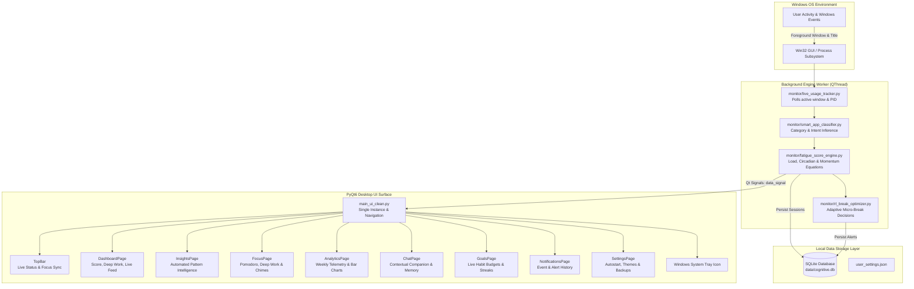

# Cognitive AI — Cognitive Fatigue & Wellbeing OS

<div align="center">

[](#)
[](#)
[](#)
[](#)
[](#)
[](#)

<p align="center">
  <strong>An autonomous, privacy-preserving desktop operating system that monitors digital work patterns, models mental fatigue in real time, and prevents burnout through intelligent micro-breaks and structured focus flow states.</strong>
</p>

</div>

---

## 📌 Table of Contents

- [1. Executive Summary](#1-executive-summary)
- [2. The Problem: Silent Cognitive Depletion](#2-the-problem-silent-cognitive-depletion)
- [3. Key Architectural Pillars](#3-key-architectural-pillars)
- [4. System Architecture & Data Flow](#4-system-architecture--data-flow)
- [5. Core Modules & Feature Breakdown](#5-core-modules--feature-breakdown)
  - [5.1. Real-Time Dashboard](#51-real-time-dashboard)
  - [5.2. AI Behavioral Insights](#52-ai-behavioral-insights)
  - [5.3. Deep Work & Focus Engine](#53-deep-work--focus-engine)
  - [5.4. Quantitative Analytics & Workload Telemetry](#54-quantitative-analytics--workload-telemetry)
  - [5.5. Context-Aware AI Coach](#55-context-aware-ai-coach)
  - [5.6. Goals, Streaks & Milestones](#56-goals-streaks--milestones)
  - [5.7. Activity Feed & Notification Log](#57-activity-feed--notification-log)
  - [5.8. Preferences & Windows OS Integration](#58-preferences--windows-os-integration)
- [6. Mathematical & Algorithmic Formulation](#6-mathematical--algorithmic-formulation)
  - [6.1. Fatigue Delta & Momentum Amplification](#61-fatigue-delta--momentum-amplification)
  - [6.2. Circadian Rhythm Weighting](#62-circadian-rhythm-weighting)
  - [6.3. Reinforcement Learning Micro-Break Policy](#63-reinforcement-learning-micro-break-policy)
- [7. Local Database Schema (`data/cognitive.db`)](#7-local-database-schema-datacognitivedb)
- [8. Repository Directory Structure](#8-repository-directory-structure)
- [9. Getting Started & Installation](#9-getting-started--installation)
  - [9.1. Prerequisites](#91-prerequisites)
  - [9.2. Installation Steps](#92-installation-steps)
  - [9.3. Running the Application](#93-running-the-application)
- [10. Production Packaging (Building `CognitiveAI.exe`)](#10-production-packaging-building-cognitiveaiexe)
- [11. Privacy, Local Governance & Security](#11-privacy-local-governance--security)

---

## 1. Executive Summary

**Cognitive AI** is a native Windows desktop platform designed to restore human cognitive bandwidth. Operating passively in the background with near-zero overhead, it captures active foreground application context, window transitions, and duration metrics. 

By applying biological and behavioral cognitive modeling (circadian rhythm penalties, context-switching residue, and dopamine spike tracking), Cognitive AI computes live **Cognitive Fatigue**, **Burnout Risk**, and **Focus Index** scores without ever capturing keystrokes, screenshots, or transmitting private data to external servers.

---

## 2. The Problem: Silent Cognitive Depletion

Knowledge workers and software engineers suffer from chronic mental exhaustion driven by:
- **Attention Residue:** Switching between an IDE, browser tabs, and communication tools creates an invisible context tax that degrades executive function.
- **Delayed Burnout Signals:** Humans are notoriously inaccurate at estimating their own cognitive depletion until exhaustion or loss of concentration has already occurred.
- **Unstructured Working Blocks:** Traditional timers lack context sensitivity; taking a break in the middle of a flow state disrupts focus, while skipping a break during peak fatigue triggers mental burnout.

Cognitive AI solves this by continuously monitoring digital strain and actively proposing interventions aligned with personal neural baselines.

---

## 3. Key Architectural Pillars

- **🛡️ 100% On-Device Privacy (Zero Telemetry Leakage):** All tracking, text processing, SQLite logging, and model updates occur strictly on your local machine.
- **⚡ Non-Blocking Asynchronous Engine:** High-frequency Windows event capture and state modeling execute in dedicated `QThread` workers, ensuring the PyQt6 presentation thread remains butter-smooth at 60 FPS.
- **🧠 Bio-Adaptive Modeling:** Combines deterministic cognitive load equations with reinforcement learning heuristics (Q-learning break optimization).
- **🔒 Single-Instance Native Windows Mutex:** Uses system-level `QSharedMemory` to eliminate duplicate background watchers.
- **📦 Zero-Configuration Windows Deployment:** Out-of-the-box Windows System Tray lifecycle, autostart registry hooks, taskbar grouping via explicit `AppUserModelID`, and one-click PyInstaller distribution.

---

## 4. System Architecture & Data Flow



---

## 5. Core Modules & Feature Breakdown

### 5.1. Real-Time Dashboard
- **Normalized Focus Score:** Real-time animated percentage displaying cognitive stamina.
- **Today's Productivity Grid:** Deep work hours, distraction counters, and dynamic burnout levels.
- **Active Context Card:** Current foreground process, classified category, and intensity level.
- **Focus Mode Quick Toggle:** One-click toggle with visual styling and settings persistence.
- **Live Activity Feed:** Auto-pruned log of recent context shifts and fatigue warnings.

### 5.2. AI Behavioral Insights
- **Context Switching Rhythm:** Analyzes session lengths across a 7-day rolling window to compute average context duration.
- **Peak Stamina Window:** Identifies the exact hour window where focus is highest.
- **Circadian Curve Diagnostics:** Detects afternoon mental fatigue dips and suggests low-effort reallocations.
- **Tool Correlation Analysis:** Evaluates focus longevity between primary applications (e.g. IDE vs. Web Browser).

### 5.3. Deep Work & Focus Engine
- **Structured Work Sessions:** Presets for Pomodoro (25m), Deep Work (50m), Flow (90m), Quick Break (5m), and Rest Break (15m).
- **Global TopBar Integration:** Emits live timer countdowns visible across every page of the app.
- **Audible Chime Alert:** Triggers desktop audio alerts upon session completion.
- **Database Session Persistence:** Completed sprints automatically log to `focus_sessions` in SQLite.

### 5.4. Quantitative Analytics & Workload Telemetry
- **Range Filtering:** Analyze 7-day, 30-day, or all-time workloads.
- **Interactive Daily Trend Chart:** Native PyQt6 canvas rendering minutes logged per day.
- **Category Mix Breakdown:** Proportional visualization of attention allocation (Development, Browsing, Communication, Entertainment, etc.).
- **Top Application Leaderboards:** Ranked workload by software executable.

### 5.5. Context-Aware AI Coach
- **Live Memory:** Retains current application state, session duration, and focus level to provide contextual advice.
- **Persistent Conversation History:** Conversations persist in SQLite across restarts.
- **Intelligent Fallback Architecture:** Supports local LLMs via Ollama, cloud inference via Hugging Face, or deterministic offline expert diagnostics.

### 5.6. Goals, Streaks & Milestones
- **Configurable Productivity Budgets:** Live progress bars tracking daily deep work hours, distraction limits, and total screen time budgets.
- **Consecutive Active Streaks:** Computes true consecutive active days from SQLite logs.
- **Milestone Badges:** Automatically unlocks milestone achievements as your total deep work hours accumulate.

### 5.7. Activity Feed & Notification Log
- **Chronological Alert History:** Unified log for high-fatigue warnings, streak achievements, and focus completions.
- **Semantic Priority Badges:** Color-coded priority indicators (Alert, Warning, Focus, Streak, Info).
- **History Management:** Single-click history clearing.

### 5.8. Preferences & Windows OS Integration
- **Windows Autostart:** One-click registry toggle (`HKCU\Software\Microsoft\Windows\CurrentVersion\Run`).
- **Data Export & Backups:** Export full telemetry as JSON or copy SQLite data backups.
- **Appearance & Theme Engine:** Dark modern atmosphere with curated accent palettes and density adjustments.

---

## 6. Mathematical & Algorithmic Formulation

### 6.1. Fatigue Delta & Momentum Amplification

Cognitive fatigue accumulation is governed by an event-driven delta equation:

$$\Delta F = \left( P_{\text{load}} \times M_{\text{circadian}} \times M_{\text{category}} \right) - R_{\text{recovery}}$$

Where:
- $P_{\text{load}}$ is the cognitive load penalty for the application category (Development = $+1.2$, Communication = $+0.8$, Entertainment = $-0.4$).
- $R_{\text{recovery}}$ is the recovery coefficient applied during idle or relaxation periods.
- Rapid application switching introduces momentum amplification:

$$\text{Momentum Multiplier} = 1 + \left(\frac{\text{Fatigue Momentum}}{25}\right)$$

$$\Delta F_{\text{effective}} = \Delta F \times \text{Momentum Multiplier}$$

Final fatigue is clamped within safe bounds:

$$F_{t} = \min\left(100, \max\left(0, F_{t-1} + \Delta F_{\text{effective}} + \text{Baseline Offset}\right)\right)$$

### 6.2. Circadian Rhythm Weighting

Human alertness naturally fluctuates over a 24-hour cycle. The circadian engine applies hourly multipliers:

$$M_{\text{circadian}}(h) = \begin{cases} 
1.25 & \text{if } h \in [13, 16] \quad \text{(Post-lunch dip)} \\
0.85 & \text{if } h \in [9, 11] \quad \text{(Peak morning window)} \\
1.40 & \text{if } h \in [23, 5] \quad \text{(Late night depletion)} \\
1.00 & \text{otherwise}
\end{cases}$$

### 6.3. Reinforcement Learning Micro-Break Policy

A Q-learning agent models break timing to maximize recovery while minimizing flow state disruption:

$$Q(s, a) \leftarrow Q(s, a) + \alpha \left[ R + \gamma \max_{a'} Q(s', a') - Q(s, a) \right]$$

- **States ($s$):** Discretized tuples of $(\text{Fatigue Level}, \text{Burnout Probability}, \text{Momentum})$.
- **Actions ($a$):** $\{\text{No Break}, \text{Micro-Break (2m)}, \text{Standard Break (10m)}, \text{Extended Rest (20m)}\}$.
- **Reward ($R$):** Positive for sustained focus post-break; heavily penalized if a break is proposed during an active flow state.

---

## 7. Local Database Schema (`data/cognitive.db`)

Cognitive AI uses SQLite with WAL mode for robust, concurrent read/write transactions:

```sql
-- Tracked foreground app usage sessions
CREATE TABLE IF NOT EXISTS sessions (
    id INTEGER PRIMARY KEY AUTOINCREMENT,
    app_name TEXT,
    window_title TEXT,
    category TEXT,
    duration_sec INTEGER,
    fatigue_score REAL,
    burnout_score REAL,
    timestamp DATETIME DEFAULT CURRENT_TIMESTAMP
);

-- Turn-by-turn AI coaching conversations
CREATE TABLE IF NOT EXISTS chat_history (
    id INTEGER PRIMARY KEY AUTOINCREMENT,
    user_msg TEXT,
    ai_msg TEXT,
    timestamp DATETIME DEFAULT CURRENT_TIMESTAMP
);

-- Auditable notifications, warnings, and achievements
CREATE TABLE IF NOT EXISTS notifications (
    id INTEGER PRIMARY KEY AUTOINCREMENT,
    priority TEXT,
    message TEXT,
    timestamp DATETIME DEFAULT CURRENT_TIMESTAMP
);

-- Deliberate focus session sprint history
CREATE TABLE IF NOT EXISTS focus_sessions (
    id INTEGER PRIMARY KEY AUTOINCREMENT,
    duration_sec INTEGER,
    status TEXT,
    timestamp DATETIME DEFAULT CURRENT_TIMESTAMP
);
```

---

## 8. Repository Directory Structure

```text
cognitive_fatigue_ai_clean/
├── assets/                       # Static visual resources & icons
│   └── icon.ico                  # Application Windows icon
├── analytics/                    # Data aggregation & analytics engines
│   └── analytics_manager.py      # Multi-day telemetry & metric calculators
├── core/                         # Core abstractions & cross-cutting state
│   └── app_state.py              # Shared memory state contracts
├── dashboard/                    # Supplemental dashboard components
│   ├── day_detail_page.py        # Day detail views
│   └── day_detail_panel.py       # Slide-out interactive drilldown panel
├── data/                         # SQLite stores, models & calibration files
│   ├── cognitive.db              # Main structured database
│   ├── neural_baseline.json      # Learned user baseline parameters
│   └── user_profile.json         # Profile weights & history
├── monitor/                      # Background monitoring & modeling engines
│   ├── ai_companion_engine.py    # Local/cloud AI coach inference & fallbacks
│   ├── auto_start.py             # Windows registry autostart manager
│   ├── circadian_engine.py       # Circadian curve multipliers
│   ├── fatigue_score_engine.py   # Primary fatigue accumulation engine
│   ├── live_usage_tracker.py     # Win32 foreground polling thread
│   ├── rl_break_optimizer.py     # Reinforcement learning break decider
│   ├── smart_app_classifier.py   # App & window semantic categorizer
│   └── ui_worker.py              # Asynchronous QThread engine worker
├── storage/                      # Persistence layer
│   └── db.py                     # SQLite connection manager & CRUD helpers
├── ui/                           # PyQt6 presentation layer
│   ├── components/               # Modular UI building blocks
│   │   ├── core_ui.py            # Cards, badges, and animation primitives
│   │   ├── sidebar.py            # Collapsible navigation rail
│   │   └── topbar.py             # Status indicators & focus countdown
│   ├── pages/                    # Main application screens
│   │   ├── analytics_page.py     # Workload telemetry & charts
│   │   ├── chat_page.py          # AI Coach companion interface
│   │   ├── dashboard_page.py     # Main operational dashboard
│   │   ├── focus_page.py         # Deep work sprint timer
│   │   ├── goals_page.py         # Habit budgets & milestones
│   │   ├── insights_page.py      # Behavioral intelligence cards
│   │   ├── notifications_page.py # Notification history feed
│   │   └── settings_page.py      # Preferences & system controls
│   ├── widgets/                  # Custom Qt graphics & charts
│   │   ├── charts.py             # Native PyQt6 bar charts
│   │   └── rings.py              # Circular progress rings
│   ├── onboarding_page.py        # First-launch welcome experience
│   └── theme.py                  # Dark stylesheet & visual design system
├── .env                          # Environment secrets (optional API keys)
├── build.bat                     # Windows one-click release compiler
├── main_ui_clean.py              # Application main entry point
├── package_app.py                # PyInstaller packaging configuration
├── requirements-core.txt         # Core Python dependencies
└── user_settings.json            # Persisted user configuration & goals
```

---

## 9. Getting Started & Installation

### 9.1. Prerequisites

- **Operating System:** Windows 10 or Windows 11 (64-bit)
- **Python:** Version `3.10`, `3.11`, or `3.12`
- **Compiler/Tools:** PowerShell 5.1+ or Windows Terminal

### 9.2. Installation Steps

1. **Clone the repository:**
   ```bash
   git clone https://github.com/your-username/cognitive-fatigue-ai.git
   cd cognitive-fatigue-ai
   ```

2. **Create and activate a virtual environment:**
   ```powershell
   python -m venv venv
   .\venv\Scripts\Activate.ps1
   ```

3. **Install dependencies:**
   ```powershell
   pip install -r requirements-core.txt
   ```

### 9.3. Running the Application

You can launch Cognitive AI using either the **Electron + TypeScript Glassmorphic UI** or the **Native PyQt6 Desktop UI**:

#### Option A: Modern Electron + TypeScript Desktop UI (Recommended)
This delivers the high-fidelity obsidian glassmorphic interface, Web Audio binaural soundscapes, animated SVG stamina rings, and confetti celebrations:

```powershell
# 1. Start the zero-dependency Python bridge server (Terminal 1)
python bridge_server.py

# 2. Launch the Electron Desktop application (Terminal 2)
cd electron-app
npm start
```
*Tip: To run in hot-reload developer mode:*
```powershell
cd electron-app
npm run dev
```

#### Option B: Native PyQt6 Desktop UI
```powershell
python main_ui_clean.py
```

The application window will initialize. Upon first launch, an onboarding flow configures your baseline settings. Once completed, Cognitive AI runs quietly in the system tray.

---

## 10. Production Packaging (Building `CognitiveAI.exe`)

To package Cognitive AI as a standalone, zero-dependency Windows executable:

1. **Run the packaging script:**
   ```powershell
   python package_app.py
   ```
   *Or double-click:*
   ```powershell
   .\build.bat
   ```

2. **Output Artifact:**
   PyInstaller compiles the entire runtime into:
   ```text
   dist/CognitiveAI/
   ├── CognitiveAI.exe
   ├── assets/
   ├── user_settings.json
   └── _internal/
   ```
3. Distribute the `dist/CognitiveAI/` directory or wrap it with an installer such as Inno Setup or NSIS.

---

## 11. Privacy, Local Governance & Security

Cognitive AI is engineered around strict privacy-first principles:

- **No Keylogging:** Keystrokes, keyboard input, and mouse coordinates are never recorded or monitored.
- **No Screen Captures:** Zero screenshots or video buffers are stored or transmitted.
- **Ephemeral Telemetry:** Window titles are classified strictly in volatile RAM into broad categories before discarding sensitive strings.
- **Full Data Sovereignty:** All historical records are stored locally in SQLite (`data/cognitive.db`). You can inspect, backup, export, or delete your database at any time from the Preferences screen.
